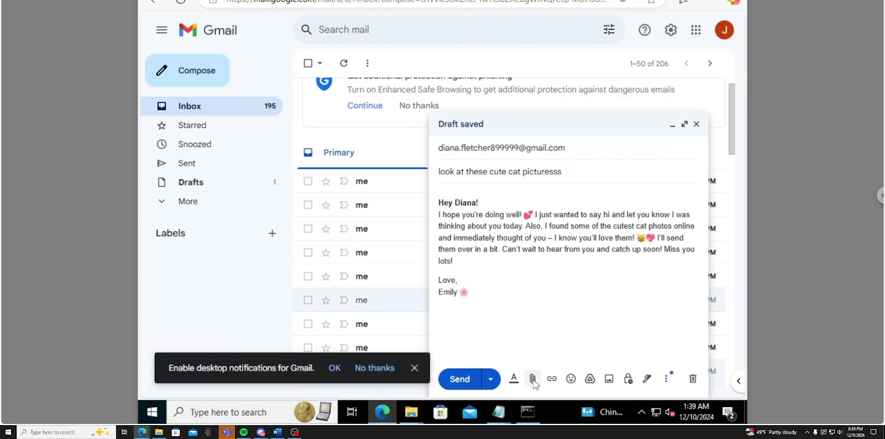
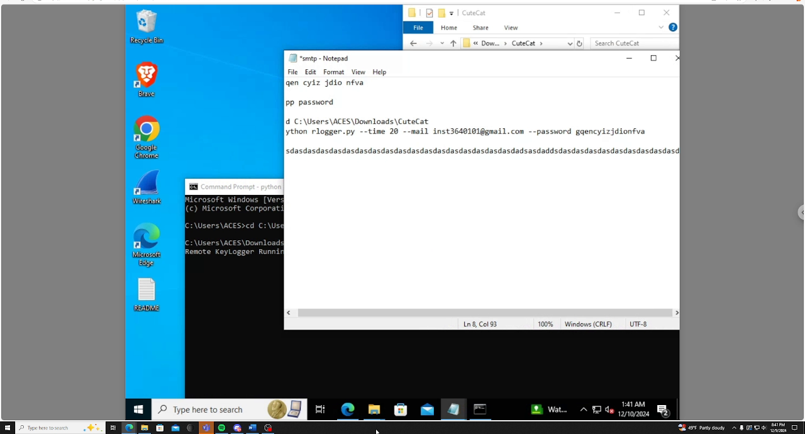
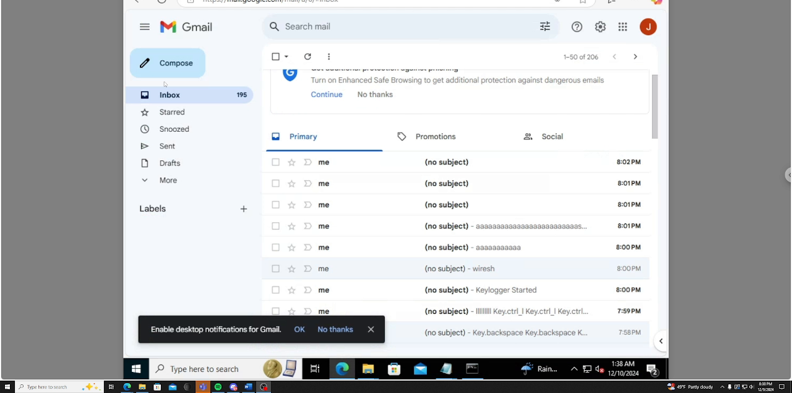
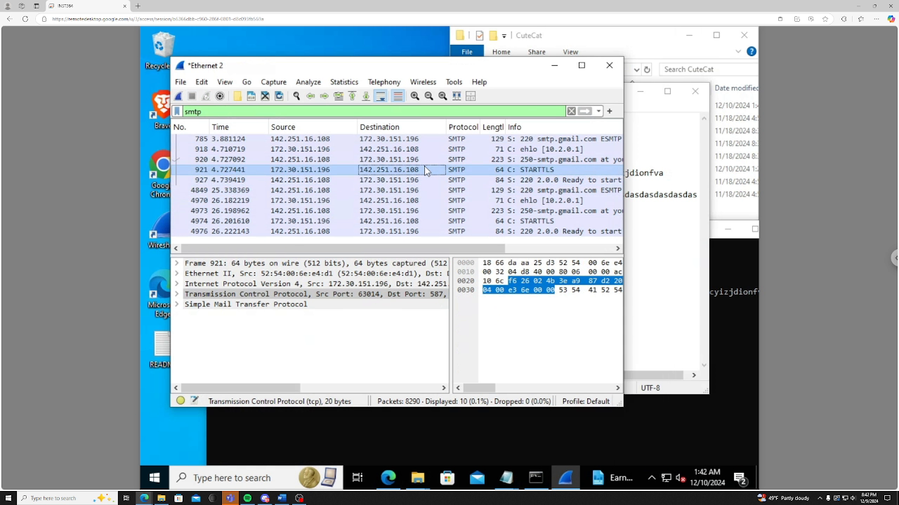

# Phishing & Keylogger Demo: An End-to-End Social Engineering Attack

A solo project that walks through a full phishing attack against a fictional persona: profile-building from public information, a spoofed email impersonating a family member, a malware-laced attachment disguised as cat photos, and analysis of the resulting network traffic in Wireshark. 

## Disclaimer

This was an academic project conducted entirely against a **fictional persona** ("Diana Fletcher") on a self-built Windows virtual machine, hosted on a University of Maryland VLAN under the INST364 course. No real person was targeted, no real email account was compromised, and no real systems were attacked. The keylogger used is an existing open-source tool, used here for educational purposes inside an authorized university lab. Real credentials, contact information, and identifiers have been redacted from the public version of the writeup. The project's contribution is the **end-to-end attack scenario and analysis**, not the malware itself.

---

## Project at a Glance

| | |
|---|---|
| **What** | A complete phishing attack walkthrough: target profiling, spoofed-sender email, disguised malware attachment, payload execution, and packet capture |
| **Where** | Self-built Windows VM on a University of Maryland VLAN, remotely accessible via Google Remote Desktop |
| **When** | Fall 2024 |
| **Why** | Show how cognitive bias, social trust, and a single careless click can lead to total compromise. Equally important: show how to detect and defend against it. |
| **Result** | Successful end-to-end demonstration. 195+ batches of captured keystrokes delivered to the attacker's inbox over the course of the demo, with the exfiltration traffic visible in Wireshark on port 587. |

---

## Skills Demonstrated

- **Lab environment build:** stood up a Windows victim VM on a UMD-provided VLAN, configured the user account, made it remotely accessible via Google Remote Desktop, and installed both the keylogger and Wireshark for analysis
- **Social engineering / OSINT:** built a complete attacker profile of the target from public sources (LinkedIn, public records, social media) and identified a trusted sender to impersonate
- **Phishing email design:** crafted a convincing pretext using familiarity, normalcy bias, and anchoring effects to lower the target's guard
- **Malware delivery & disguise:** packaged a Python SMTP keylogger as innocuous "cute cat" media to bypass casual scrutiny
- **Keylogger operation:** configured and deployed an SMTP-based keylogger that exfiltrates captured input every 20 seconds via Google SMTP on port 587
- **Network forensics with Wireshark:** captured and filtered the keylogger's outbound traffic using `tcp.port == 587` and `smtp` to demonstrate the detection-side workflow
- **Threat awareness:** explained fileless malware, living-off-the-land attacks, and the limits of hash-based antivirus
- **Defensive thinking:** translated the attack into concrete recommendations spanning user training, endpoint protection, network controls, and policy
- **Technical writing for non-technical readers:** documented the project so a recruiter without security background can follow the story

---

## Project Structure

| File | Description |
|------|-------------|
| [`docs/ProjectWriteup.md`](docs/ProjectWriteup.md) | Full project writeup: persona, phishing scheme, technical background, demo walkthrough, defensive recommendations |
| [`images/`](images/) | Screenshots from the demo video showing each stage of the attack |

> The original PDF submission and full demo video are available on request.

---

## The Attack Story (Non-Technical)

### Step 1: The attacker profiles the target

A fictional attacker, "Jon," wants to compromise a fictional accountant, "Diana." He doesn't know her, but he doesn't need to. Using only public information (LinkedIn, public records, social media), Jon learns:

- Diana's job and employer
- That she has one sister, Emily, who recently moved overseas
- That Emily is publicly listed as Diana's contact on social media
- That Emily's Gmail address is sitting in plain view on her Instagram profile

### Step 2: The attacker picks a trusted sender to impersonate

Sisters who live overseas tend to email each other often. International texting is expensive. So Jon decides Emily is the right person to impersonate. He registers a near-identical Gmail address.

### Step 3: The attacker sends the phishing email

Subject: *"look at these cute cat picturesss"*. The body is warm and casual, signed "Emily." Attached is a folder called `CuteCat (4K)`, which looks like a 4K image bundle. It is not. It is a Python keylogger disguised as media.

*The phishing email being composed in the attacker's Gmail. Note the warm, casual tone signed "Emily," addressed to the target's personal/work email.*

### Step 4: Diana opens it

Three cognitive biases work against her at once:

- **Familiarity:** the sender looks like her sister
- **Normalcy bias:** the message matches what she expects from her sister
- **Anchoring:** the warm tone sets the mood before she critically evaluates

She opens the attachment.

### Step 5: The keylogger silently runs

The keylogger reports `Remote KeyLogger Running` and starts capturing every keystroke Diana makes. Every 20 seconds, it bundles the captured input and emails it back to the attacker via Google's SMTP server on port 587.

*On the victim VM: Notepad on the left shows live keystrokes being intercepted. The Command Prompt below shows the keylogger process running silently in the background.*

### Step 6: The attacker's inbox fills up

Over the course of the demo, **195+ batches** of captured keystrokes arrived in the attacker's inbox. Subject lines like `Key.ctrl_l Key.ctrl_l`, `wiresh`, and `asdasdasd` reveal exactly what was being typed, including modifier keys and partial words.

*The attacker's Gmail inbox after the keylogger has been running. Each "(no subject)" line is a 20-second batch of intercepted keystrokes. Visible captures include `Key.ctrl_l`, `wiresh` (a partial word being typed), and rows of `aaaaaaaa` from test typing.*

### Step 7: The defender catches it (eventually)

Wireshark, running on Diana's machine, captures the outbound traffic. Filtering on `tcp.port == 587` and `smtp` isolates the keylogger's exfiltration to the Google SMTP server: this is exactly what a real defender or analyst would do to confirm an active compromise.

*Wireshark on the victim VM showing the SMTP exfiltration flow. Source `142.251.16.108` is the Google SMTP server (`smtp.gmail.com`); destination `172.30.151.196` is the victim VM. The capture shows the back-and-forth: the VM sending captured keystrokes outbound to Google's SMTP server on port 587, and the SMTP server responding back. This is the network-level signature an analyst would look for to confirm the compromise.*

---

## Why This Project Matters (For Recruiters)

A successful phishing attack does not require a sophisticated zero-day exploit. It requires:

1. A few hours of public-source research
2. A plausible pretext built around the target's relationships
3. A payload that survives a casual look from a busy person

This project shows that I can think on **both sides of that exchange**: how an attacker plans and executes a low-tech, high-success-rate attack, and how a defender can detect it after the fact using standard tools. The most effective defenses, as the writeup discusses, are not technical: they are training, verification habits, and policy. That perspective is valuable for any role at the intersection of security and people.

---

## Limitations and Honest Notes

- **Sandboxed environment.** The attack would behave the same way against a real machine, but actually targeting one would be illegal and unethical.
- **Existing keylogger source.** I did not write the keylogger. I integrated and operated an existing open-source tool ([rajusiripalli/Remote_keylogger](https://github.com/rajusiripalli/Remote_keylogger)) inside the broader attack scenario I designed. The contribution is the scenario, the analysis, and the writeup.
- **Single demo run.** The numbers (195+ inbox batches) reflect the demo session captured on video. Different exfiltration intervals, durations, or typing speeds would yield different counts.

---

*Author: Henry Nguyen.*
