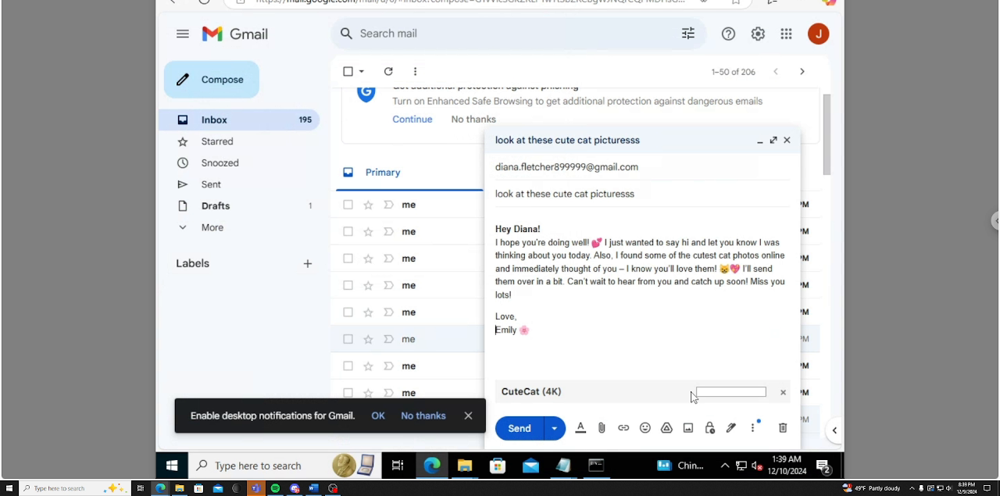
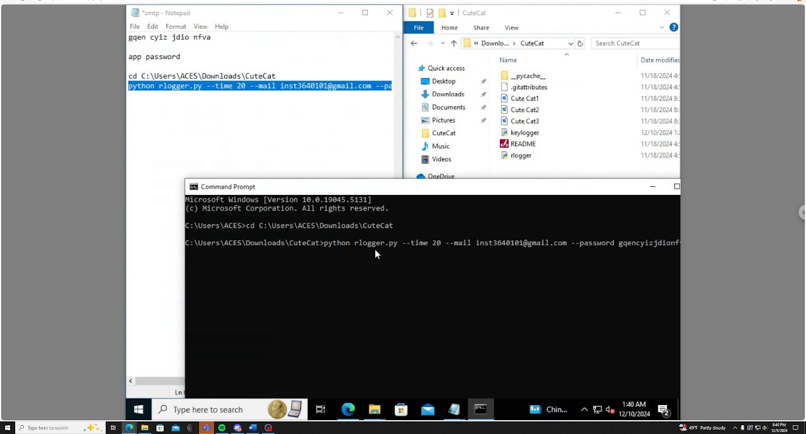
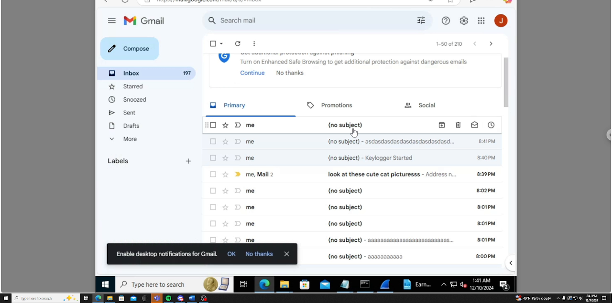

# Phishing and Malware: Project Submission

**University of Maryland: INST364 (Human-Centered Cybersecurity)**
**Author:** Henry Nguyen

> Solo project. Demonstrates an end-to-end phishing attack against a fictional persona using an SMTP-based keylogger disguised as cute cat photos, with Wireshark analysis of the resulting network traffic.

---

## Lab Environment

The victim machine in this project was a self-built Windows VM hosted on a University of Maryland VLAN. To make the demonstration reproducible without needing physical access to the lab, the VM was configured to be remotely accessible via **Google Remote Desktop**, gated behind the Google account's two-factor authentication. The VM had:

- A configured user account standing in for the persona Diana
- The Python keylogger downloaded into a folder named `CuteCat`, intended to mirror what would arrive in a real phishing email
- **Wireshark** installed for the defender-side analysis
- Outbound traffic on port 587 permitted so the keylogger's SMTP exfiltration would actually leave the host

This is the lab equivalent of building a small but realistic target environment. It's the same kind of setup a security team uses to safely study malware: contained, controlled, and reproducible.

---

## Persona and Phishing Scheme

### Target persona

| | |
|---|---|
| **Name** | Diana Fletcher |
| **Occupation** | Accountant |
| **Age** | 38 |
| **Location** | Illinois |
| **Tech proficiency** | Moderate. Familiar with basic computer use; relies heavily on email day-to-day; has had basic cybersecurity training (spotting phishing trends). Her busy schedule occasionally leads her to prioritize efficiency over caution. |

### Background

Diana is a meticulous accountant at a mid-sized financial advising firm. She manages payroll, client accounts, and financial reporting, often working with sensitive personal and business data. She knows better than to hold client data on her local system: the firm has an encrypted storage unit, key-protected, that houses important client and employee data.

### The phishing scheme

The attacker (call him **Jon Jones**) targeted Diana for some time. He found her on LinkedIn, then ran open-source intelligence (OSINT) on public records to build a profile. He discovered that Diana has one sibling, Emily, with whom she is close. Emily recently moved overseas, so she and Diana exchange emails frequently (international texting bills add up).

What Jon didn't know is that Emily is less tech-savvy than Diana, and Emily has her Gmail address publicly listed on her Instagram profile (a common occurrence in modern social media). Jon had been running this same attack pattern against many targets, expecting that one would land, and now he had the opening he needed.

Jon crafted a spoofed email impersonating Emily, with a keylogger payload disguised as cute cat photos. Diana, exposed to a familiar sender and warm tone, downloaded the images.

### Why the attack worked: cognitive biases at play

1. **Availability heuristic (familiarity).** Diana has been exposed to Emily's email naming patterns and tone for years. She associates emails carrying Emily's name with Emily, and instinctively trusts them.
2. **Normalcy bias.** The email's contents align with what Diana expects from Emily, so she assumes everything is normal.
3. **Anchoring effect.** The subject line and warm tone anchor Diana's interpretation of the situation as friendly: a familiar sense of closeness from her beloved sister.
4. **Detection blind spots.** Windows Defender and similar tools reference databases of known malware hashes, and monitor for behavioral anomalies. Well-designed keyloggers can obfuscate code to change their hash and hide inside images. Some are *fileless*: they operate entirely in memory and leave no disk trace, evading scanners.
5. **Living-off-the-land attacks.** Building on the previous point, fileless attacks don't require an attacker to drop a script onto disk: they exploit existing system tools (e.g., PowerShell) to execute payloads. They depend on unpatched software and known vulnerabilities in the host's existing programs.

---

## Technical Background

### SMTP keylogger functionality

A **keylogger** is malware that records the keystrokes of an infected user and sends them back to the attacker. It's a popular tool for stealing credentials, monitoring users, and aiding privilege escalation.

The keylogger used here is an **SMTP keylogger** (Python). It uses **port 587** (Google's default SMTP submission port, encrypted) to email captured keystrokes to the attacker's Gmail account.

| Feature | Detail |
|---------|--------|
| Exfiltration interval | Every 20 seconds |
| Implementation | Python script |
| Port | 587 (Google SMTP submission) |
| Captured input | All keystrokes including backspace, delete, modifier keys |
| Persistence | Runs as a process on the victim's machine |

> The keylogger source used in this project was an existing open-source tool ([rajusiripalli/Remote_keylogger](https://github.com/rajusiripalli/Remote_keylogger) on GitHub), not custom-written. The project's contribution is the **end-to-end attack scenario**: persona development, OSINT-driven phishing scheme, payload disguise, deployment in a sandboxed VM, and network-traffic analysis of the result.

### Wireshark analysis

Wireshark, a network protocol analyzer, was installed on the victim VM to observe how the keylogger communicates over the network. It captures all traffic crossing the network interface.

Filters used to isolate the malicious packets:

- `smtp`
- `tcp.port == 587`

These filters surface the keylogger's outbound emails to the attacker's Gmail SMTP server.

---

## Demonstration

The full demo was recorded as a 5-minute video. Selected frames are embedded below to walk through the attack from the attacker's perspective and the victim's perspective.

### 1. Crafting the phishing email

The attacker drafts an email impersonating "Emily," addressed to Diana. Subject: `look at these cute cat picturesss`. The body uses a familiar, warm tone.

*The phishing email being composed in Gmail. The body is warm and casual, signed "Emily," to leverage the target's familiarity with her sister's tone.*

The "cute cat" payload is then attached. The attachment looks like a normal media file (`CuteCat (4K)`), but it is the disguised keylogger.

*Same email with the attachment now visible. `CuteCat (4K)` is named to look like a 4K image bundle, but it is the keylogger.*

### 2. Victim downloads and runs the attachment

On the victim's machine (a sandboxed VM), the attached "CuteCat" folder is opened. Inside are the keylogger's Python files (`keylogger`, `rlogger`, etc.).

*Inside the victim VM. Notepad (top left) shows the keylogger startup command. File Explorer (right) shows the contents of the unzipped `CuteCat` folder, including the Python files. Command Prompt (bottom) shows the script being launched.*

The keylogger is launched with parameters specifying the exfiltration interval, the attacker's Gmail address, and a Gmail app password.

### 3. Live keystroke capture

Once running, the keylogger reports `Remote KeyLogger Running` and silently captures everything typed. Below, Notepad shows test typing being intercepted.

*The keylogger reports `Remote KeyLogger Running` (bottom). Test typing in Notepad (top) is being intercepted in real time. Nothing about this state would be visible to a normal user.*

### 4. Exfiltration: keystrokes arrive in the attacker's inbox

Every 20 seconds, batches of captured keystrokes arrive in the attacker's Gmail inbox. Subject lines reflect the captured input directly (`Key.ctrl_l Key.ctrl_l`, `wiresh`, `Key.backspace ...`).

*Each `(no subject)` line is a 20-second batch of intercepted keystrokes. Visible captures include `Key.ctrl_l`, `wiresh` (a partial word being typed in real time), and rows of `aaaaaaaa` from test typing.*

The same inbox in real time, with new batches arriving alongside the original phishing email:

*The phishing email itself (`look at these cute cat picturesss`) is visible in the same inbox as the captured keystrokes, including a `Keylogger Started` notice. Cause and effect, side by side.*

### 5. Wireshark analysis of the exfiltration traffic

Wireshark, running on the victim VM, captures the outbound SMTP traffic. Filtering on `tcp.port == 587` and `smtp` isolates the keylogger's exfiltration packets to the Google SMTP server.

*Wireshark on the victim VM showing the SMTP exfiltration flow. Source `142.251.16.108` is the Google SMTP server (`smtp.gmail.com`); destination `172.30.151.196` is the victim VM. The capture shows the back-and-forth: the VM sending captured keystrokes outbound to Google's SMTP server on port 587, and the SMTP server responding back. This is the network-level signature an analyst would look for to confirm an active compromise.*

---

## Defensive Recommendations

How a real-world Diana (or her employer) could defend against this attack:

1. **User awareness and education.** Continual phishing training keeps employees vigilant. It feels redundant, but consistency is what builds the habit.
2. **Endpoint protection.** Anti-malware with behavior-based detection (not just hash-matching) can flag suspicious activity even when the binary is novel.
3. **Network security.** Firewall rules can block outbound SMTP to unknown servers, allowing only approved devices to send mail through legitimate SMTP servers. Other commonly abused ports (FTP, SFTP, specific TCP ranges) can be blocked outright if not needed, reducing the attack surface.
4. **Don't use company computers for personal activity.** A hard rule to enforce, but the most reliable. If enforcement is impractical, system administrators can apply web-browsing restrictions, email-domain warnings, and policy-based registry restrictions to limit exposure.
5. **Verify before clicking or downloading.** When a friend or family member sends an unexpected file, confirm out-of-band (separate email or message) before opening it. The two-second pause is worth it.

---

## Citations

- LaPorte, B. (2024, December 6). *Fileless malware evades detection-based security.* Morphisec. https://blog.morphisec.com/fileless-malware-attacks
- Lenaerts-Bergmans, B. (2023, February 22). *What are living off the land (LOTL) attacks?* CrowdStrike. https://www.crowdstrike.com/cybersecurity-101/living-off-the-land-attacks-lotl/
- Open-source keylogger used: [rajusiripalli/Remote_keylogger](https://github.com/rajusiripalli/Remote_keylogger)
